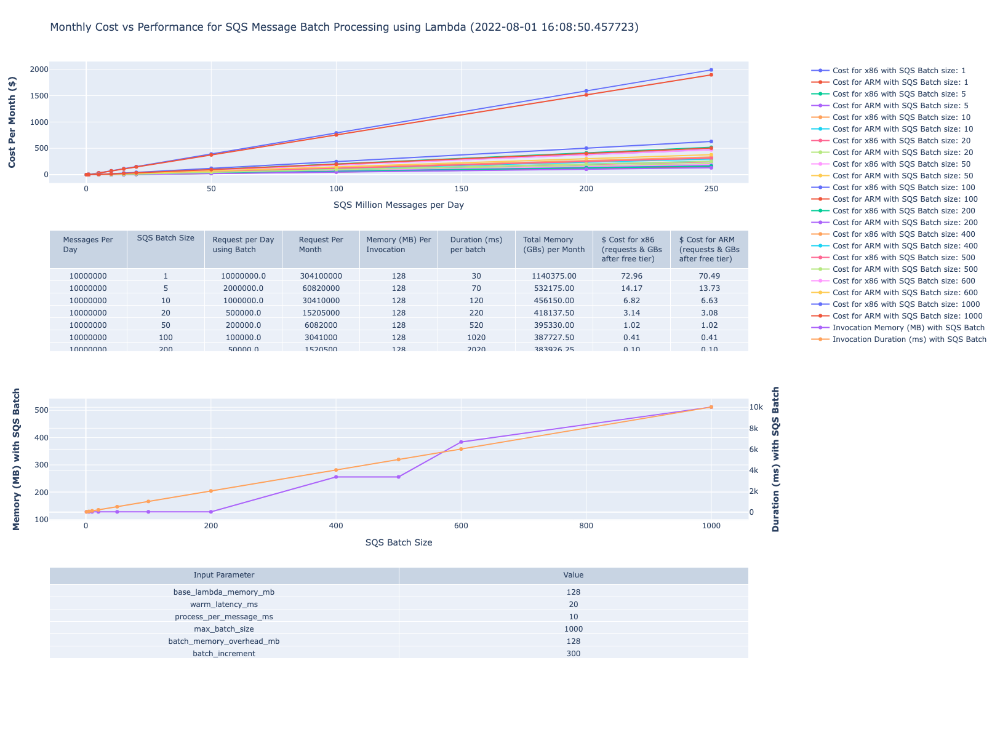
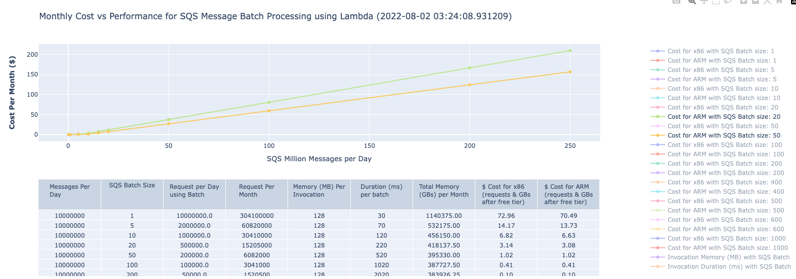
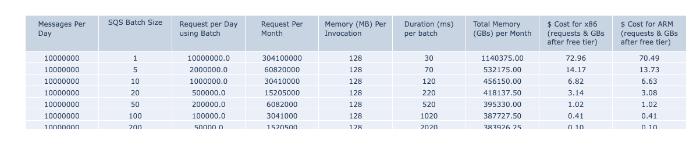
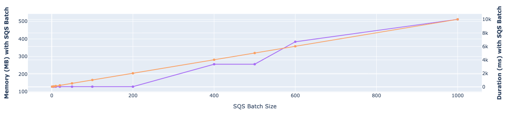
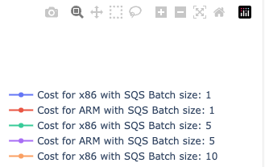

# aws-lambda-sqs-cost-estimator

This project contains sample code and supporting files for estimating monthly cost for Lambda functions that process SQS messages.

The estimator tool is a Python-based (version: 3.9) command line program that takes in an input properties file that specifies the various control parameters to come up with Lambda function cost vs performance estimations for various batch sizes, messages per day, etc. The tool does take into account the eligible monthly free tier for Lambda function executions. Its also possible to quickly build and use a docker image rather than requiring local Python install.

## Requirements

The tool requires Python 3.9 and installation of Plotly package (5.7.+). One can use the included Docker approach if necessary to avoid local Python installs.

## Costs Estimations

The tool would generate the monthly cost estimations for processing various range of messages (in millions) per day with a constant base memory for the Lambda function, while allocating additional memory as additional batch of messages are all processed as part of the same event. Costs would be generated for both x86 and ARM (Graviton) architecture for comparison.

There are various input parameters for the cost estimations specified inside the input.prop file. Tune the input parameters as needed:

| Parameter	|          Description	        | Sample value (units not included) |
| :-- | :---: | :-- |
| base_lambda_memory_mb |	Baseline memory for the Lambda function (in MB) |	128 |
| warm_latency_ms	Invocation |  time for Lambda handler method before it starts actual processing of incoming message (with warm start) irrespective of batch size in the incoming event payload in ms. |	20 |
| process_per_message_ms | 	Time to process a single message (linearly scales with number of messages per batch in event payload) in ms. |	10 |
| max_batch_size | Maximum batch size per event payload processed by a single Lambda instance	| 1000 (max is 10000) |
| batch_memory_overhead_mb | Additional memory for processing increments in batch size (in MB) |	128 |
| batch_increment | 	Increments of batch size for increased memory	| 300 |

`Sample input.prop file content`:
```
base_lambda_memory_mb=128

# Total process time for N messages in batch = warm_latency_ms + (process_per_message_ms * N)
# Time spent in function initialization/warm-up
warm_latency_ms=20

# Time spent for processing each message in milliseconds
process_per_message_ms=10

# Max batch size
max_batch_size=1000

# Additional lambda memory X mb required for managing/parsing/processing N additional messages processed when using variable batch sizes
#batch_memory_overhead_mb=X
#batch_increment=N

batch_memory_overhead_mb=128
batch_increment=300
```

## Sample cost estimates

The tool would generate plots and graphs of the cost of execution of the Lambda functions for processing SQS messages against varying batch sizes for both x86 and ARM platform, with details in tabular form for a 10 million messages processed per day with varying batch sizes.



The generated image is interactive support Click through and selecting specific batch sizes and zooming function.



One can look at monthly cost for handling 10 million messages per day to find the optimal batch size.



The increase in memory for higher batch sizes (memory can increase for processing/handling larger batches compared to small batch sizes) is also plotted to verify or play with the assumptions used by the tool.


The last table shows the various input parameters.

The generated plots can be also exported as PNG images for sharing/comparison using the Photo icon.


## Steps to run application using Python3.9

Ensure Python3.9 (and pip3) is installed and available before proceeding.
Clone the Repository and then install the Plotly packages required by the tool for generating plots before running the tool.

```
git clone https://github.com/aws-samples/aws-lambda-sqs-cost-estimator
cd aws-lambda-sqs-cost-estimator/code
pip3 install -r requirements.txt

# Edit the input.prop file and then run the tool to generate cost estimations
python3 LambdaPlotly.py

```
Access the generated graphs on the local browser to view the generated cost estimates. Edit the `input.prop` file as needed to try with different settings and rerun the tool.

## Steps to run application using Docker image

Ensure Docker is installed and available on local machine before proceeding.
Clone the Repository and then build the docker image and run it before running the estimator tool.

```
git clone https://github.com/aws-samples/aws-lambda-sqs-cost-estimator
cd aws-lambda-sqs-cost-estimator/code

docker build -t lambda-dash .
docker run -it  -v `pwd`:/app  -p 8080:8080 lambda-dash

```
Access the flask application accessible at http://0.0.0.0:8080/app to view the generated cost estimates. Edit the `input.prop` file as needed to try with different settings and rerun the docker instance (no need to rebuild the docker image as the property file is separate from the image).

## Resources

See the [AWS Lambda Pricing](https://aws.amazon.com/lambda/pricing/) for more details on Lambda Pricing.

## Security

See [CONTRIBUTING](CONTRIBUTING.md#security-issue-notifications) for more information.

## License

This library is licensed under the MIT-0 License. See the [LICENSE](LICENSE) file.
